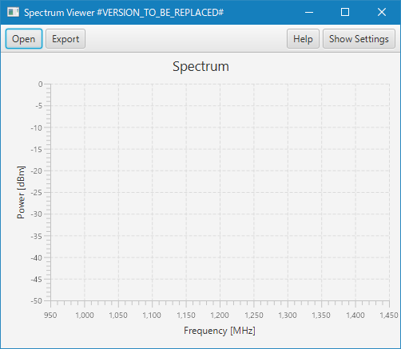
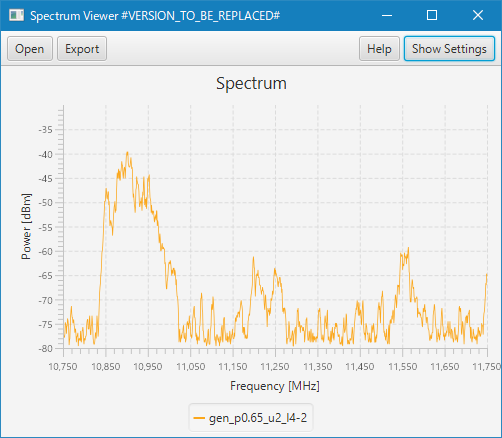

# Spectrum File Viewer

Visualize spectrums as line charts with frequency axis and power axis.
The spectrum is read from a binary format file exported by the Satellite Spectrum Monitoring System
made by Glowlink Communications Technologies Inc.

## Build the program

This program is written in Java language, and build by JDK 11+ with JavaFX.

1. Build by gradle
2. Build by IntelliJ IDEA

The build generates an executable module JAR file `SpectrumFileViewer.jar`.

### Build requirements

* JDKs 11+ with OpenJFX are as follows: 
  * [ZuluFX](https://jp.azul.com/downloads/zulu-community/?architecture=x86-64-bit&package=jdk-fx)
  * [Liberica JDK full](https://bell-sw.com/pages/downloads/?architecture=x86&package=jdk-full)
  
* Build tools are as follows:
  * Gradle wrapper is included in this project.
  * IntelliJ IDEA (Community Edition) 

### by gradle

* Set PATH to JDK 11+ with OpenJFX javac
* Execute `gradlew build` in command line

### by IntelliJ IDEA

* Open from IntelliJ IDEA
* [Build] menu > [Build Project]

## Run the program in build environment



### from a command line

```
D:\work\SpectrumFileViewer> java -p build\libs -m com.torutk.spectrum

```

### from an IntelliJ IDEA

* [Run] menu > [Edit Configurations], add new configuration of gradle with task run.
* run the configuration above. 

## Operate the program

T.B.D.

## Configure the program

### logging

This program uses Java Util Logging.
Logging can be configured by a property file specified by the system property 'java.util.logging.config.file'.

* [Java SE 11 Documentation > Core Libraries > Java Logging Overview](https://docs.oracle.com/en/java/javase/11/core/java-logging-overview.html)

T.B.D.

### UI customization

User interface can be configured by a cascade style sheet file named `SpectrumFileView.css`
placed in the parent of current directory, or it's sub directory within max depth of 3.

* [JavaFX CSS Reference Guide - Release JavaFX 8](https://docs.oracle.com/javase/8/javafx/api/javafx/scene/doc-files/cssref.html)

T.B.D.
 
## Technical comments

T.B.D.

## Other tools

### Generate test spectrum data

This program has a command-line tool for generating test spectrum data file.
The generated spectrum data is based on a markov model. 

#### usage

* under build environment, show usage

```
D:\work\SpectrumFileViewer> java -cp build\libs\SectrumFileViewer com.torutk.spectrum.data.RandomGenerator
Command line usage: -f <file> -p <probability> -u <upper shift> -l <lower shift>
        file: spectrum data file to be generated
        probability: of power increased (0.0 to 1.0) by markov model
        upper shift: amount of power increase in a step
        lower shift: amount of power decrease in a step
```

* for example, apply probability=0.65 upper shift=2 lower shift=4,

```
D:\work\SpectrumFileViewer> java -cp build\libs\SectrumFileViewer com.torutk.spectrum.data.RandomGenerator ^
 -f gen_p0.65_u2_l4.dat -p 0.65 -u 2 -l 4
```


